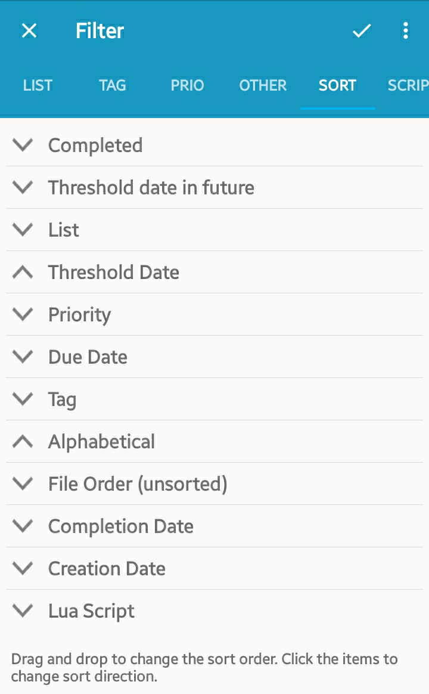

Manage Your Now
===============

Erstellen der Listen für MYN
------------------------------

In MYN gibt es drei Dringlichkeitszonen, die wir in Simpletask mit drei Listen in der folgenden Reihenfolge abbilden: 

- Jetzt dringend -\> `@CriticalNow`
- Jetzt erledigen -\> `@OpportunityNow`
- Hinter dem Horizont -\> `@OverTheHorizon`

Darüber hinaus definiert MYN eine Zone für wesentliche Ergebnisse (Significant Outcome - SOC), die über den anderen Zonen ganz oben auf der Liste angeordnet wird. Hierfür erstellen wir eine weitere Liste

- Wesentliches Ergebnis -\> `@!SOC`

Im `todo.txt`-Format werden Listen durch Aufgaben erzeugt, denen diese Listen zugeordnet sind. Dies hat den Nachteil, dass die Listen verschwinden, sobald die letzte Aufgabe mit dieser Liste aus der todo.txt-Datei gelöscht wird.

Um Listen persistent zu machen, kann man in Simpletask Aufgaben mit dem Schalter `h:1` verstecken. Damit werden sie in der Aufgabenliste standardmäßig nicht angezeigt und ihre Tags und Listen bleiben dauerhaft verfügbar. 

Für jede MYN-Liste, fügen wir also eine versteckte Aufgabe hinzu, z.B.:

    @CriticalNow h:1

Einrichten der Sortierung für MYN
---------------------------------

 

Um Aufgaben in Simpletask bis zur Wiedervorlage auszublenden ("Defer-To-Do" und "Defer-To-Review" in MYN), kann man ihnen mit `t:yyyy-mm-dd` Anfangsdaten zuweisen. 

Stellen Sie sicher, dass in den Einstellungen das `Defer by threshold date` markiert ist.

Sie können Aufgaben, deren Anfangsdaten in der Zukunft liegt, entweder verbergen (siehe Registerkarte "Other" in den Filtereinstellungen) oder Sie können sie ans Ende der Liste sortieren (so sind sie noch sichtbar, aber aus dem Weg). Um dies zu erreichen, verwenden Sie die Sortierung `Anfangsdatum in der Zukunft`. 

Ein weiteres wichtiges Konzept von MYN ist, neue Aufgaben am Anfgang der Liste und ältere weiter unten anzuzeigen. Hierfür sortiert man die Liste nach dem umgekehrten Anfangsdatum, siehe Beispiel in der Abbildung. Die weiteren Sortierkriterien haben nur geringe Bedeutung.

Arbeiten mit der Liste
----------------------

Wenn Sie nun Ihre Aufgabenliste durchsehen und eine oder mehrere Aufgaben verschieben möchten, können Sie sie markieren und mit dem Button in der Symbolleiste ein neues Anfangsdatum setzen. 
Einige in MYN / 1MTD häufig verwendete Auswahloptionen sind bereits voreingestellt, Sie können aber auch ein bestimmtes Datum mit dem Kalender wählen.
Die Aufgabe wird nun entweder bis zum gewählten Datum ausgeblendet oder aber ans Ende der Liste und damit aus dem Blickfeld verschoben.
