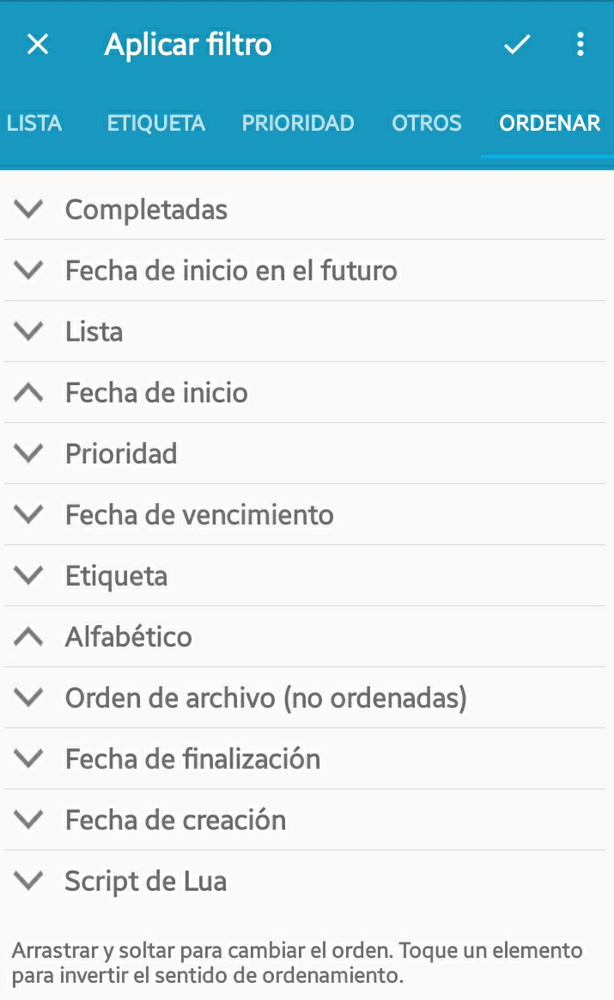

Gestione Su Ahora (Manage Your Now - MYN)
=========================================

Creando los contextos para MYN
------------------------------

MYN define 3 zonas de urgencia, que nosotros hacemos corresponder a listas en Simpletask de tal manera que se ordenen correctamente.

-   Crítico Ahora -\> `@CriticalNow`
-   Oportunidad Ahora -\> `@OpportunityNow`
-   Más allá del Horizonte -\> `@OverTheHorizon`

Además MYN define una zona de Resultado Significativo (SOC - Significant Outcome) que necesita estar en lo alto de su lista. Para conseguirlo, lo hacemos corresponder a:

-   Resultado Significativo -\> `@!SOC`

Una desventaja del formato `todo.txt` en combinación con Simpletask es que si el archivo no contiene ningún elemento con una lista específica, la lista no aparecerá en Simpletask. Para evitar esto, Simpletask tiene un concepto llamado tareas escondidas. Estas tareas están marcadas con \`h:1' y de forma predeterminada no aparecerán en el listado de tareas. Sin embargo, cualquier etiqueta o lista definida para esta tarea sí estará disponible.

Así que, para hacer las listas MYN persistentes, añada una tarea escondida para cada una p. ej.:

    @CriticalNow h:1

Configurando la ordenación para MYN
-----------------------------------

Para diferir tareas en Simpletask a Diferir-Hacer o Diferir-Revisar  utilizamos la función fecha umbral. Asegurese de que en ajustes el `Diferir por fecha umbral` está marcado. Entonces puede usar la fecha umbral `t:yyyy-mm-dd` como fecha de comienzo en MYN/1MTD.

Puede o bien esconder tareas futuras (desde la solapa `Otro` de filtros) o bien ordenarlas hacia el final (de modo que todavía son visibles pero sin interferir). Para conseguirlo  utilizamos la ordenación `Fecha umbral en el futuro`. La otra configuración necesaria es ordenar su lista por fecha umbral invertida de modo que las tareas más antiguas serán ordenadas más atrás en la lista. Además de que realmente no importará cómo ordene después de eso, vea la imagen para un ejemplo.

Utilizando la lista
-------------------

Cuando este revisando los elementos en su lista y quiera diferir una o más tareas, las puede seleccionar y utilizar el elemento de menú `diferir` en el menú. Hay algunas opciones ya rellenas que utilizaría a menudo en MYN/1MTD o puede diferirla a una fecha específica. Después de diferir la tarea se moverá al final del listado si ha sido diferida al futuro y fuera de su vista.

